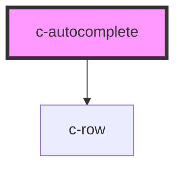

# c-autocomplete

<!-- Auto Generated Below -->

## Properties

| Property   | Attribute  | Description | Type                                 | Default     |
| ---------- | ---------- | ----------- | ------------------------------------ | ----------- |
| `dense`    | `dense`    |             | `boolean`                            | `undefined` |
| `items`    | --         |             | `{ name: string; value: string; }[]` | `[]`        |
| `label`    | `label`    |             | `string`                             | `undefined` |
| `name`     | `name`     |             | `string`                             | `undefined` |
| `query`    | `query`    |             | `any`                                | `null`      |
| `required` | `required` |             | `boolean`                            | `null`      |
| `value`    | `value`    |             | `any`                                | `null`      |

## Events

| Event         | Description | Type               |
| ------------- | ----------- | ------------------ |
| `changeValue` |             | `CustomEvent<any>` |

## Dependencies

### Depends on

- [c-row](../row)

### Graph

----------------------------------------------

*Built with [StencilJS](https://stenciljs.com/)*
