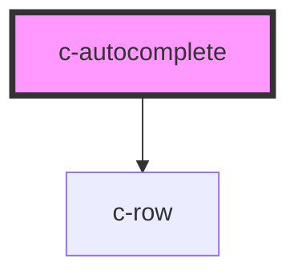

# c-autocomplete

<!-- Auto Generated Below -->

## Properties

| Property | Attribute | Description | Type     | Default     |
| -------- | --------- | ----------- | -------- | ----------- |
| `label`  | `label`   |             | `string` | `undefined` |
| `name`   | `name`    |             | `string` | `undefined` |
| `query`  | `query`   |             | `any`    | `null`      |
| `value`  | `value`   |             | `any`    | `null`      |

## Dependencies

### Depends on

- [c-row](../row)

### Graph

----------------------------------------------

*Built with [StencilJS](https://stenciljs.com/)*
