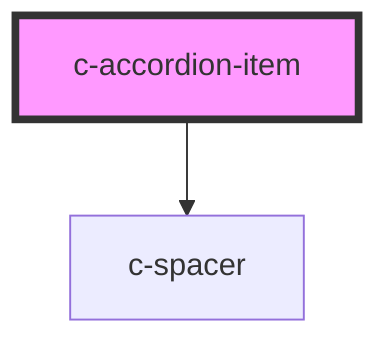

# c-accordion-item

<!-- Auto Generated Below -->

## Properties

| Property   | Attribute  | Description                                                                                    | Type                                             | Default     |
| ---------- | ---------- | ---------------------------------------------------------------------------------------------- | ------------------------------------------------ | ----------- |
| `expanded` | `expanded` | Expansion status of the item                                                                   | `boolean`                                        | `false`     |
| `heading`  | `heading`  | Heading of the accordion item                                                                  | `string`                                         | `undefined` |
| `icon`     | `icon`     | **[DEPRECATED]** Please use the icon slot instead  Icon | `"bell" \| "disabled" \| "enabled" \| "pending"` | `undefined` |
| `value`    | `value`    | Value of the accordion item                                                                    | `number \| string`                               | `undefined` |

## Events

| Event        | Description                     | Type               |
| ------------ | ------------------------------- | ------------------ |
| `itemChange` | Emit changes to the c-accordion | `CustomEvent<any>` |

## Dependencies

### Depends on

- [c-spacer](../spacer)

### Graph

----------------------------------------------

*Built with [StencilJS](https://stenciljs.com/)*
