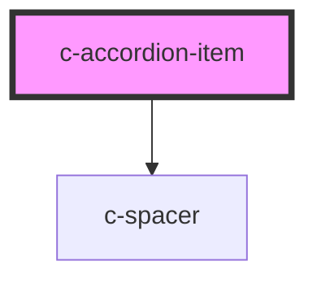

# c-accordion-item

<!-- Auto Generated Below -->

## Properties

| Property  | Attribute | Description | Type      | Default     |
| --------- | --------- | ----------- | --------- | ----------- |
| `heading` | `heading` |             | `string`  | `undefined` |
| `icon`    | `icon`    |             | `string`  | `undefined` |
| `value`   | `value`   |             | `boolean` | `false`     |

## Events

| Event         | Description | Type               |
| ------------- | ----------- | ------------------ |
| `changeValue` |             | `CustomEvent<any>` |

## Dependencies

### Depends on

- [c-spacer](../spacer)

### Graph

----------------------------------------------

*Built with [StencilJS](https://stenciljs.com/)*
