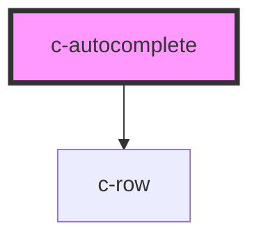

# c-autocomplete

<!-- Auto Generated Below -->

## Properties

| Property       | Attribute        | Description                         | Type                                 | Default     |
| -------------- | ---------------- | ----------------------------------- | ------------------------------------ | ----------- |
| `dense`        | `dense`          | Dense variant                       | `boolean`                            | `undefined` |
| `items`        | --               | Items to be selected                | `{ name: string; value: string; }[]` | `[]`        |
| `itemsPerPage` | `items-per-page` | Items per page before adding scroll | `number`                             | `undefined` |
| `label`        | `label`          | Element label                       | `string`                             | `undefined` |
| `query`        | `query`          | Search string                       | `string`                             | `null`      |
| `required`     | `required`       | Show required validation            | `boolean`                            | `null`      |
| `value`        | --               | Selected item                       | `{ name: string; value: string; }`   | `null`      |

## Events

| Event         | Description                        | Type               |
| ------------- | ---------------------------------- | ------------------ |
| `changeQuery` | Triggered when text is typed       | `CustomEvent<any>` |
| `changeValue` | Triggered when an item is selected | `CustomEvent<any>` |

## Dependencies

### Depends on

- [c-row](../c-row)

### Graph

----------------------------------------------

*Built with [StencilJS](https://stenciljs.com/)*
