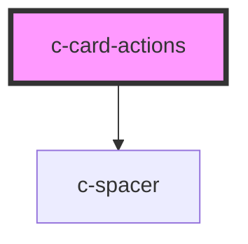

# c-card-actions

<!-- Auto Generated Below -->

## Properties

| Property | Attribute | Description                | Type      | Default |
| -------- | --------- | -------------------------- | --------- | ------- |
| `right`  | `right`   | Align actions to the right | `boolean` | `false` |

## Slots

| Slot | Description  |
| ---- | ------------ |
|      | Card actions |

## Dependencies

### Depends on

- [c-spacer](../c-spacer)

### Graph

----------------------------------------------

*Built with [StencilJS](https://stenciljs.com/)*
