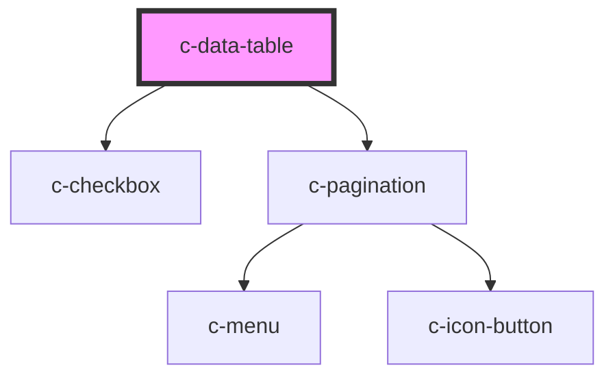

# c-datatable

<!-- Auto Generated Below -->

## Properties

| Property            | Attribute            | Description                                               | Type                      | Default                                                                                                                                  |
| ------------------- | -------------------- | --------------------------------------------------------- | ------------------------- | ---------------------------------------------------------------------------------------------------------------------------------------- |
| `data`              | --                   | Data of the table                                         | `CDataTableData[]`        | `[]`                                                                                                                                     |
| `externalData`      | `external-data`      | Externally sorted and paginated data                      | `boolean`                 | `false`                                                                                                                                  |
| `footerOptions`     | --                   | Items per page options                                    | `CDataTableFooterOptions` | `{     itemsPerPageOptions: [5, 25, 50, 100],     hideDetails: false,     simple: false,     hideRange: false,     size: 'default',   }` |
| `headers`           | --                   | Headers of the table                                      | `CDataTableHeader[]`      | `[]`                                                                                                                                     |
| `loading`           | `loading`            | Show a loader on top of the table                         | `boolean`                 | `false`                                                                                                                                  |
| `loadingText`       | `loading-text`       | Text shown when there is no data and the table is loading | `string`                  | `'Loading data'`                                                                                                                         |
| `noDataText`        | `no-data-text`       | Text shown when there are no data available               | `string`                  | `'No data'`                                                                                                                              |
| `pagination`        | --                   | Pagination options                                        | `CPaginationOptions`      | `undefined`                                                                                                                              |
| `selectable`        | `selectable`         | Make rows selectable                                      | `boolean`                 | `false`                                                                                                                                  |
| `selectionProperty` | `selection-property` | Property used in selections                               | `string`                  | `null`                                                                                                                                   |
| `singleExpansion`   | `single-expansion`   | Allow only a single row expanded at a time                | `boolean`                 | `false`                                                                                                                                  |
| `sortBy`            | `sort-by`            | Sort data by                                              | `any`                     | `null`                                                                                                                                   |
| `sortDirection`     | `sort-direction`     | Sorting direction                                         | `"asc" \| "desc"`         | `null`                                                                                                                                   |

## Events

| Event       | Description                | Type                              |
| ----------- | -------------------------- | --------------------------------- |
| `expand`    | Triggered on row expansion | `CustomEvent<any>`                |
| `paginate`  | Triggered on pagination    | `CustomEvent<CPaginationOptions>` |
| `selection` | Triggered on selection     | `CustomEvent<any>`                |
| `sort`      | Triggered on sort          | `CustomEvent<any>`                |

## Dependencies

### Depends on

- [c-checkbox](../c-checkbox)
- [c-pagination](../c-pagination)

### Graph

----------------------------------------------

*Built with [StencilJS](https://stenciljs.com/)*
