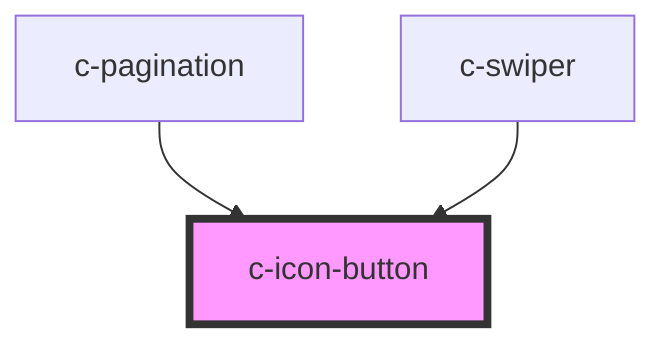

# c-icon-button

<!-- Auto Generated Below -->

## Properties

| Property   | Attribute  | Description                     | Type                                | Default     |
| ---------- | ---------- | ------------------------------- | ----------------------------------- | ----------- |
| `badge`    | `badge`    | Show a badge on top of the icon | `string`                            | `undefined` |
| `disabled` | `disabled` | Disable the button              | `boolean`                           | `false`     |
| `ghost`    | `ghost`    | Ghost variant of the button     | `boolean`                           | `false`     |
| `outlined` | `outlined` | Outlined variant of the button  | `boolean`                           | `false`     |
| `size`     | `size`     | Size of the button              | `"default" \| "small" \| "x-small"` | `'default'` |
| `text`     | `text`     | Text variant of the button      | `boolean`                           | `false`     |

## Slots

| Slot | Description               |
| ---- | ------------------------- |
|      | Default slot for the icon |

## Dependencies

### Used by

 - [c-pagination](../c-pagination)
 - [c-swiper](../c-swiper)

### Graph

----------------------------------------------

*Built with [StencilJS](https://stenciljs.com/)*
