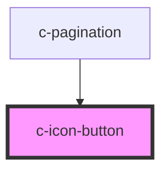

# c-icon-button

<!-- Auto Generated Below -->

## Properties

| Property   | Attribute  | Description | Type                   | Default     |
| ---------- | ---------- | ----------- | ---------------------- | ----------- |
| `badge`    | `badge`    |             | `string`               | `undefined` |
| `disabled` | `disabled` |             | `boolean`              | `undefined` |
| `ghost`    | `ghost`    |             | `boolean`              | `undefined` |
| `icon`     | `icon`     |             | `string`               | `undefined` |
| `outlined` | `outlined` |             | `boolean`              | `undefined` |
| `size`     | `size`     |             | `"default" \| "small"` | `'default'` |
| `text`     | `text`     |             | `boolean`              | `undefined` |

## Dependencies

### Used by

 - [c-pagination](../c-pagination)

### Graph

----------------------------------------------

*Built with [StencilJS](https://stenciljs.com/)*
