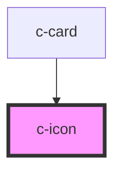

# c-icon

<!-- Auto Generated Below -->

## Properties

| Property | Attribute | Description                | Type     | Default                |
| -------- | --------- | -------------------------- | -------- | ---------------------- |
| `color`  | `color`   | Fill color                 | `string` | `'var(--csc-primary)'` |
| `path`   | `path`    | Svg path d attribute value | `string` | `undefined`            |
| `size`   | `size`    | Icon size in pixels        | `number` | `24`                   |

## Dependencies

### Used by

 - [c-card](../c-card)

### Graph

----------------------------------------------

*Built with [StencilJS](https://stenciljs.com/)*
