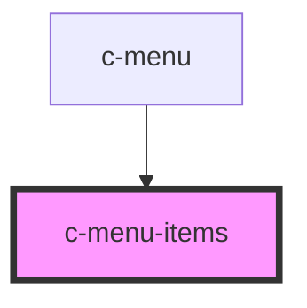

# c-menu-items

<!-- Auto Generated Below -->

## Properties

| Property | Attribute | Description   | Type            | Default |
| -------- | --------- | ------------- | --------------- | ------- |
| `active` | `active`  | is active     | `boolean`       | `false` |
| `items`  | --        | Menu items    | `CMenuOption[]` | `[]`    |
| `small`  | `small`   | Small variant | `boolean`       | `false` |

## Events

| Event   | Description                   | Type               |
| ------- | ----------------------------- | ------------------ |
| `close` | Triggered when menu is closed | `CustomEvent<any>` |

## Dependencies

### Used by

 - [c-menu](../c-menu)

### Graph

----------------------------------------------

*Built with [StencilJS](https://stenciljs.com/)*
