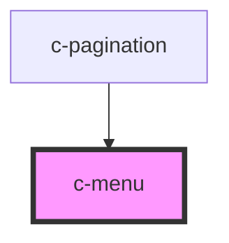

# c-menu

<!-- Auto Generated Below -->

## Properties

| Property        | Attribute | Description                                                                        | Type                 | Default     |
| --------------- | --------- | ---------------------------------------------------------------------------------- | -------------------- | ----------- |
| `customTrigger` | --        | Programmatic trigger component                                                     | `CMenuCustomTrigger` | `undefined` |
| `items`         | --        | Menu items                                                                         | `CMenuOption[]`      | `[]`        |
| `nohover`       | `nohover` | No hover background                                                                | `boolean`            | `false`     |
| `simple`        | `simple`  | Simple variant without chevron and background, E.g. when a button is the activator | `boolean`            | `false`     |
| `small`         | `small`   | Small variant                                                                      | `boolean`            | `false`     |

## Slots

| Slot | Description                                     |
| ---- | ----------------------------------------------- |
|      | Menu title / activator element (simple variant) |

## Dependencies

### Used by

 - [c-pagination](../c-pagination)

### Graph

----------------------------------------------

*Built with [StencilJS](https://stenciljs.com/)*
