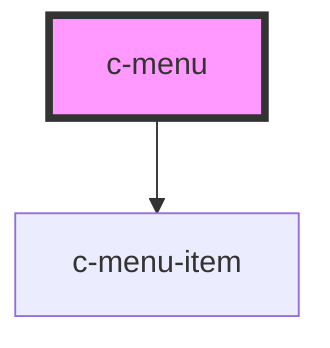

# c-menu

<!-- Auto Generated Below -->

## Properties

| Property | Attribute | Description | Type      | Default                                                              |
| -------- | --------- | ----------- | --------- | -------------------------------------------------------------------- |
| `items`  | --        |             | `any[]`   | `[     // { name: 'Default 1', action: () => alert('action') },   ]` |
| `simple` | `simple`  |             | `boolean` | `false`                                                              |

## Dependencies

### Depends on

- [c-menu-item](../c-menu-item)

### Graph

----------------------------------------------

*Built with [StencilJS](https://stenciljs.com/)*
