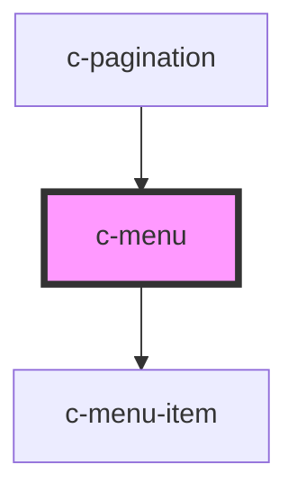

# c-menu

<!-- Auto Generated Below -->

## Properties

| Property  | Attribute | Description                                                                        | Type                                    | Default |
| --------- | --------- | ---------------------------------------------------------------------------------- | --------------------------------------- | ------- |
| `items`   | --        | Menu items                                                                         | `{ name: string; action: Function; }[]` | `[]`    |
| `nohover` | `nohover` | No hover background                                                                | `boolean`                               | `false` |
| `simple`  | `simple`  | Simple variant without chevron and background, E.g. when a button is the activator | `boolean`                               | `false` |
| `small`   | `small`   | Small variant                                                                      | `boolean`                               | `false` |

## Slots

| Slot | Description                                     |
| ---- | ----------------------------------------------- |
|      | Menu title / activator element (simple variant) |

## Dependencies

### Used by

 - [c-pagination](../c-pagination)

### Depends on

- [c-menu-item](../c-menu-item)

### Graph

----------------------------------------------

*Built with [StencilJS](https://stenciljs.com/)*
