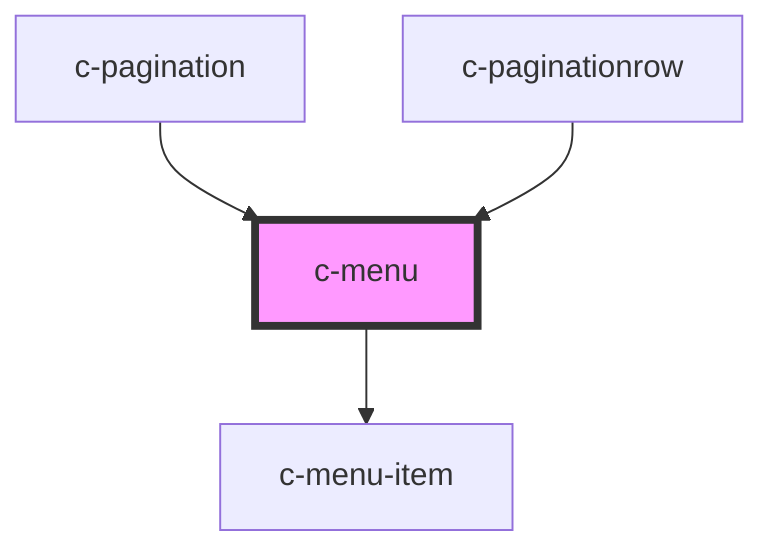

# c-menu

<!-- Auto Generated Below -->

## Properties

| Property  | Attribute | Description | Type      | Default                                                              |
| --------- | --------- | ----------- | --------- | -------------------------------------------------------------------- |
| `items`   | --        |             | `any[]`   | `[     // { name: 'Default 1', action: () => alert('action') },   ]` |
| `nohover` | `nohover` |             | `boolean` | `false`                                                              |
| `simple`  | `simple`  |             | `boolean` | `false`                                                              |
| `small`   | `small`   |             | `boolean` | `false`                                                              |

## Dependencies

### Used by

 - [c-pagination](../c-pagination)
 - [c-paginationrow](../c-paginationrow)

### Depends on

- [c-menu-item](../c-menu-item)

### Graph

----------------------------------------------

*Built with [StencilJS](https://stenciljs.com/)*
