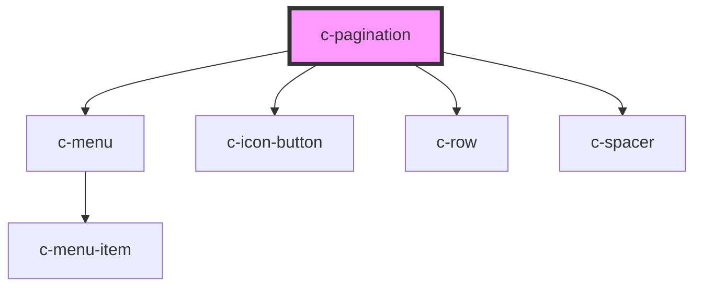

# c-pagination

<!-- Auto Generated Below -->

## Properties

| Property              | Attribute    | Description                                                                                                                                        | Type                                                                                                                             | Default            |
| --------------------- | ------------ | -------------------------------------------------------------------------------------------------------------------------------------------------- | -------------------------------------------------------------------------------------------------------------------------------- | ------------------ |
| `hideRange`           | `hide-range` | Hide range indicator                                                                                                                               | `boolean`                                                                                                                        | `false`            |
| `itemsPerPageOptions` | --           | Items per page options                                                                                                                             | `number[]`                                                                                                                       | `[5, 25, 50, 100]` |
| `value`               | --           | Object containing values that are needed for pagination.  Note! startFrom and endTo are assigned automatically to the object based on other values | `{ itemCount: number; currentPage?: number; totalVisible?: number; itemsPerPage?: number; startFrom?: number; endTo?: number; }` | `undefined`        |

## Events

| Event         | Description                       | Type                                                                                                                                          |
| ------------- | --------------------------------- | --------------------------------------------------------------------------------------------------------------------------------------------- |
| `changeValue` | Triggered when values are changed | `CustomEvent<{ itemCount: number; currentPage?: number; totalVisible?: number; itemsPerPage?: number; startFrom?: number; endTo?: number; }>` |

## Dependencies

### Depends on

- [c-menu](../c-menu)
- [c-icon-button](../c-icon-button)
- [c-row](../c-row)
- [c-spacer](../c-spacer)

### Graph

----------------------------------------------

*Built with [StencilJS](https://stenciljs.com/)*
