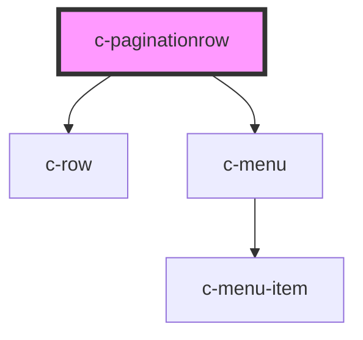

# c-paginationrow

<!-- Auto Generated Below -->

## Properties

| Property       | Attribute        | Description | Type     | Default                                                             |
| -------------- | ---------------- | ----------- | -------- | ------------------------------------------------------------------- |
| `items`        | --               |             | `any[]`  | `[{value: 1}, {value: 10}, {value: 15}, {value: 20}, {value: 100}]` |
| `itemsPerPage` | `items-per-page` |             | `number` | `undefined`                                                         |
| `itemsTotal`   | `items-total`    |             | `number` | `undefined`                                                         |
| `pageNumber`   | `page-number`    |             | `number` | `undefined`                                                         |

## Dependencies

### Depends on

- [c-row](../row)
- [c-menu](../c-menu)

### Graph

----------------------------------------------

*Built with [StencilJS](https://stenciljs.com/)*
