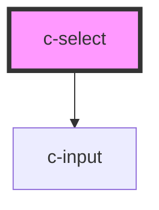

# c-select

<!-- Auto Generated Below -->

## Properties

| Property         | Attribute          | Description                                                  | Type                              | Default            |
| ---------------- | ------------------ | ------------------------------------------------------------ | --------------------------------- | ------------------ |
| `autofocus`      | `autofocus`        | Auto focus the input                                         | `boolean`                         | `false`            |
| `disabled`       | `disabled`         | Disable the input                                            | `boolean`                         | `false`            |
| `hideDetails`    | `hide-details`     | Hide the hint and error messages                             | `boolean`                         | `false`            |
| `hint`           | `hint`             | Hint text for the input                                      | `string`                          | `''`               |
| `hostId`         | `id`               | Id of the element                                            | `string`                          | `undefined`        |
| `items`          | --                 | selectable items                                             | `CSelectItem[]`                   | `[]`               |
| `itemsPerPage`   | `items-per-page`   | Items per page before adding scroll                          | `number`                          | `6`                |
| `label`          | `label`            | Element label                                                | `string`                          | `undefined`        |
| `name`           | `name`             | Input field name                                             | `string`                          | `undefined`        |
| `placeholder`    | `placeholder`      | Placeholder text                                             | `string`                          | `''`               |
| `required`       | `required`         | Show required validation                                     | `boolean`                         | `null`             |
| `returnValue`    | `return-value`     | Return only the item value rather than the whole item object | `boolean`                         | `undefined`        |
| `shadow`         | `shadow`           | Shadow variant                                               | `boolean`                         | `false`            |
| `valid`          | `valid`            | Set the validíty of the input                                | `boolean`                         | `true`             |
| `validate`       | `validate`         | Manual validation                                            | `boolean`                         | `false`            |
| `validateOnBlur` | `validate-on-blur` | Validate the input on blur                                   | `boolean`                         | `false`            |
| `validation`     | `validation`       | Custom validation message                                    | `string`                          | `'Required field'` |
| `value`          | `value`            | Selected item                                                | `CSelectItem \| number \| string` | `null`             |

## Events

| Event         | Description                        | Type               |
| ------------- | ---------------------------------- | ------------------ |
| `changeValue` | Triggered when an item is selected | `CustomEvent<any>` |

## Dependencies

### Depends on

- [c-input](../c-input)

### Graph

----------------------------------------------

*Built with [StencilJS](https://stenciljs.com/)*
