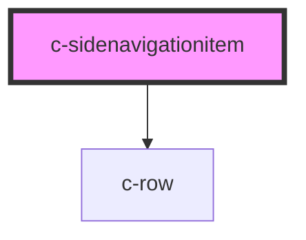

# c-sidenavigationitem

<!-- Auto Generated Below -->

## Properties

| Property | Attribute | Description           | Type      | Default     |
| -------- | --------- | --------------------- | --------- | ----------- |
| `active` | `active`  | Indicate active state | `boolean` | `undefined` |
| `href`   | `href`    | Hyperlink url         | `string`  | `undefined` |

## Dependencies

### Depends on

- [c-row](../c-row)

### Graph

----------------------------------------------

*Built with [StencilJS](https://stenciljs.com/)*
