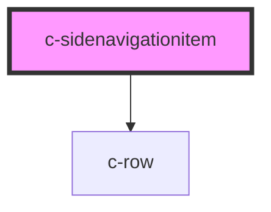

# c-sidenavigationitem

<!-- Auto Generated Below -->

## Properties

| Property   | Attribute   | Description | Type      | Default     |
| ---------- | ----------- | ----------- | --------- | ----------- |
| `active`   | `active`    |             | `boolean` | `undefined` |
| `href`     | `href`      |             | `string`  | `undefined` |
| `subItems` | `sub-items` |             | `boolean` | `undefined` |

## Dependencies

### Depends on

- [c-row](../row)

### Graph

----------------------------------------------

*Built with [StencilJS](https://stenciljs.com/)*
