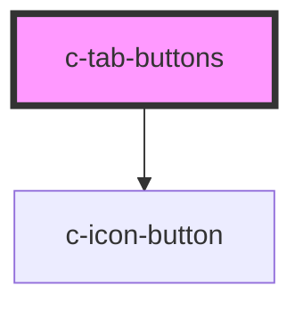

# c-tab-buttons

<!-- Auto Generated Below -->

## Properties

| Property | Attribute | Description              | Type               | Default     |
| -------- | --------- | ------------------------ | ------------------ | ----------- |
| `value`  | `value`   | Value of the tab buttons | `number \| string` | `undefined` |

## Slots

| Slot | Description                                |
| ---- | ------------------------------------------ |
|      | Default slot for the c-tab-button elements |

## Dependencies

### Depends on

- [c-icon-button](../c-icon-button)

### Graph

----------------------------------------------

*Built with [StencilJS](https://stenciljs.com/)*
