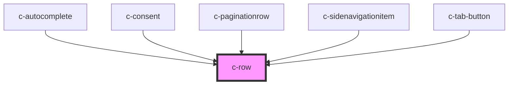

# c-row

<!-- Auto Generated Below -->

## Dependencies

### Used by

 - [c-autocomplete](../autocomplete)
 - [c-consent](../c-consent)
 - [c-paginationrow](../c-paginationrow)
 - [c-sidenavigationitem](../c-sidenavigationitem)
 - [c-tab-button](../tab-button)

### Graph

----------------------------------------------

*Built with [StencilJS](https://stenciljs.com/)*
