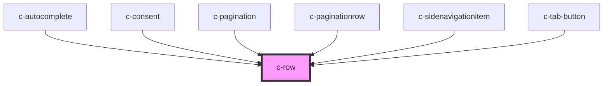

# c-row

<!-- Auto Generated Below -->

## Properties

| Property  | Attribute | Description                  | Type                                              | Default   |
| --------- | --------- | ---------------------------- | ------------------------------------------------- | --------- |
| `align`   | `align`   | Align items vertically       | `"center" \| "end" \| "start"`                    | `'start'` |
| `gap`     | `gap`     | Gap between items in px      | `number`                                          | `0`       |
| `justify` | `justify` | Justify content horizontally | `"center" \| "end" \| "space-between" \| "start"` | `'start'` |
| `wrap`    | `wrap`    | Flex wrap                    | `boolean`                                         | `true`    |

## Dependencies

### Used by

 - [c-autocomplete](../autocomplete)
 - [c-consent](../c-consent)
 - [c-pagination](../c-pagination)
 - [c-paginationrow](../c-paginationrow)
 - [c-sidenavigationitem](../c-sidenavigationitem)
 - [c-tab-button](../tab-button)

### Graph

----------------------------------------------

*Built with [StencilJS](https://stenciljs.com/)*
