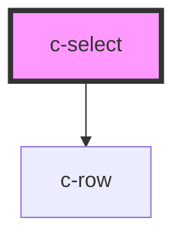

# c-select

<!-- Auto Generated Below -->

## Properties

| Property   | Attribute  | Description | Type      | Default                                                                                                                                           |
| ---------- | ---------- | ----------- | --------- | ------------------------------------------------------------------------------------------------------------------------------------------------- |
| `dense`    | `dense`    |             | `boolean` | `undefined`                                                                                                                                       |
| `items`    | --         |             | `any[]`   | `[     { name: 'Default 1', value: 'default1' },     { name: 'Default 2', value: 'default2' },     { name: 'Default 3', value: 'default3' },   ]` |
| `label`    | `label`    |             | `string`  | `undefined`                                                                                                                                       |
| `name`     | `name`     |             | `string`  | `undefined`                                                                                                                                       |
| `required` | `required` |             | `boolean` | `null`                                                                                                                                            |
| `value`    | `value`    |             | `any`     | `null`                                                                                                                                            |

## Events

| Event         | Description | Type               |
| ------------- | ----------- | ------------------ |
| `changeValue` |             | `CustomEvent<any>` |

## Dependencies

### Depends on

- [c-row](../row)

### Graph

----------------------------------------------

*Built with [StencilJS](https://stenciljs.com/)*
