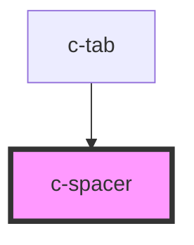

# c-spacer

<!-- Auto Generated Below -->

## Dependencies

### Used by

 - [c-tab](../tab)

### Graph

----------------------------------------------

*Built with [StencilJS](https://stenciljs.com/)*
