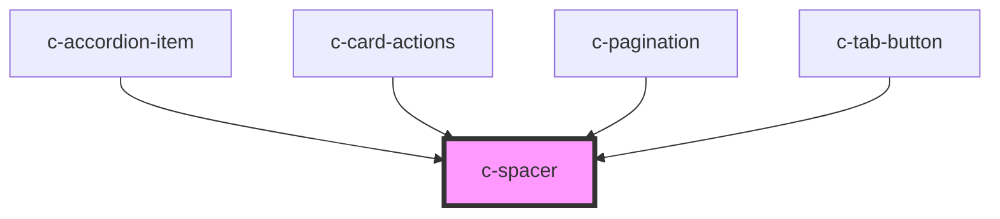

# c-spacer

<!-- Auto Generated Below -->

## Dependencies

### Used by

 - [c-accordion-item](../c-accordion)
 - [c-card-actions](../c-card-actions)
 - [c-pagination](../c-pagination)
 - [c-tab-button](../tab-button)

### Graph

----------------------------------------------

*Built with [StencilJS](https://stenciljs.com/)*
