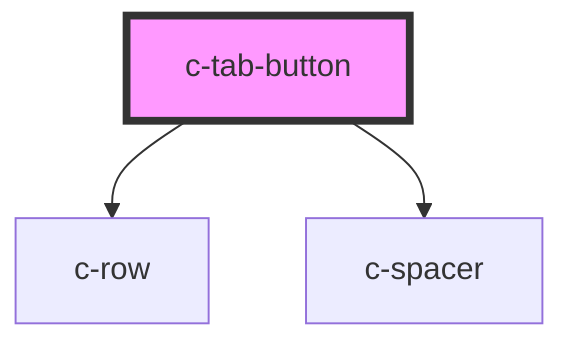

# c-tab

<!-- Auto Generated Below -->

## Properties

| Property   | Attribute  | Description | Type      | Default     |
| ---------- | ---------- | ----------- | --------- | ----------- |
| `active`   | `active`   |             | `boolean` | `undefined` |
| `color`    | `color`    |             | `string`  | `undefined` |
| `disabled` | `disabled` |             | `boolean` | `undefined` |
| `hostId`   | `id`       |             | `string`  | `undefined` |
| `icon`     | `icon`     |             | `string`  | `undefined` |
| `label`    | `label`    |             | `string`  | `undefined` |

## Dependencies

### Depends on

- [c-row](../row)
- [c-spacer](../spacer)

### Graph

----------------------------------------------

*Built with [StencilJS](https://stenciljs.com/)*
